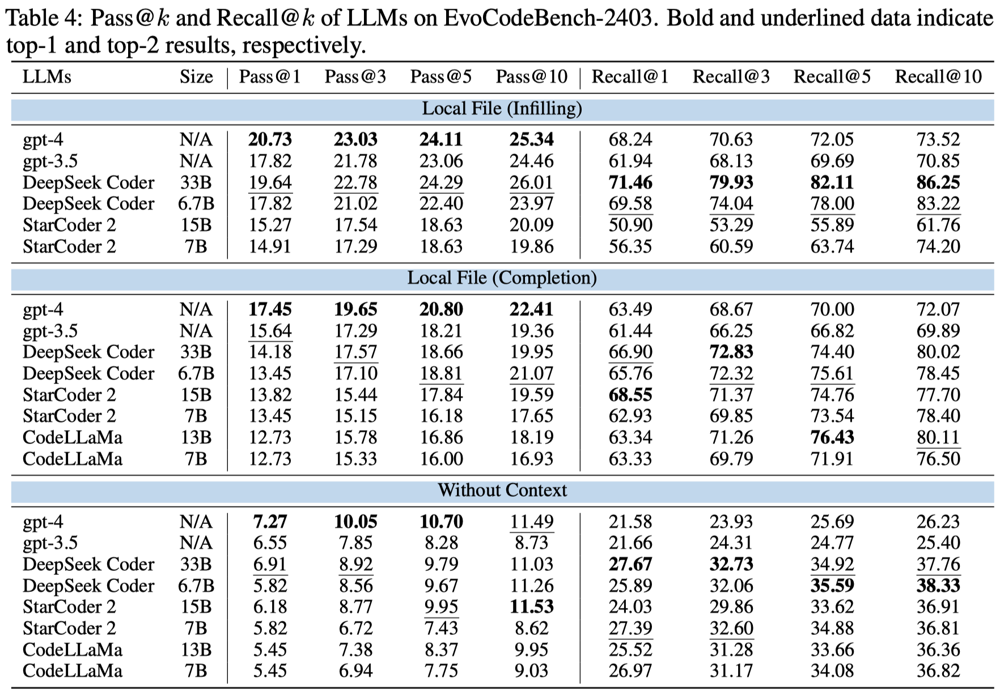

# EvoCodeBench

EvoCodeBench is an evolutionary code generation benchmark aligned with real-world code repositories. Details of EvoCodeBench can be found in our paper "EvoCodeBench: An Evolving Code Generation Benchmark Aligned with Real-world Code Repositories" [Paper](https://lj2lijia.github.io/papers/EvoCodeBench_Preprint.pdf).

## News

[Mar 29, 2024] We release EvoCodeBench and its first version - EvoCodeBench-2403.

## Outline

- [EvoCodeBench](#evocodebench)
  - [News](#news)
  - [Outline](#outline)
  - [Released Versions](#released-versions)
  - [Metadata](#metadata)
  - [Repositories and Dependency Data](#repositories-and-dependency-data)
  - [Evaluation](#evaluation)
    - [Before Evaluation](#before-evaluation)
    - [Environment Setup](#environment-setup)
    - [Output Format](#output-format)
    - [Pass@k (Functional Correctness)](#passk-functional-correctness)
    - [Recall@k (Recall of Reference Dependency)](#recallk-recall-of-reference-dependency)
  - [Repository-level Code Generation](#repository-level-code-generation)
    - [Experimental Settings](#experimental-settings)
    - [Code Generation](#code-generation)
    - [Model's Completion](#models-completion)
    - [Leaderboard](#leaderboard)
  - [Citation](#citation)

## Released Versions

| Version | Release Date | Covered Period | Number of Samples | Number of Repositories | Link |
|---------|--------------|----------------|--------------------|------------------------| ---- |
| EvoCodeBench-2403 | Mar 27, 2024 | Dec 2023 - Feb 2024 | 275 | 25 | [HuggingFace](https://huggingface.co/datasets/LJ0815/EvoCodeBench/tree/main/EvoCodeBench-2403) |

Where `Covered Period` means the time period of the repositories are created. You can download different versions of EvoCodeBench from the above links.

## Metadata


Each sample in EvoCodeBench contains the following fields:
- `namespace`: string, the unique name of the code to be generated, e.g., `benedict.utils.type_util.is_bool`.
- `type`: string, the type of the code to be generated. `method` means the code is a member function in a class, and `function` means the code is a individual function.
- `completion_path`: string, the path of the file where the code to be generated is located, e.g., `Text-Processing/python-benedict/benedict/utils/type_util.py`.
- `signature_position`: list, the start and end line number of the signature within completion files e.g., `[13, 13]`. The line number starts from 1.
- `body_position`: list, the start and end line number of the reference code within completion files e.g., `[14, 19]`. The line number starts from 0.
- `dependency`: dict, the reference dependency. The keys include `intra_class`, `intra_file`, and `cross_file`. Each key stores a list of strings, which are namespaces of reference dependencies.
- `indent`: int, the indent of the code to be generated.
- `tests`: list, a list of test functions, which are used to evaluate the generated code.
- `requirement`: dict, the requirement of the code to be generated. The keys include `Functionality` and `Arguments`. `Functionality` is a string describing the functionality of the code to be generated. `Arguments` is a string explaining the input and output parameters.
- `domain`: string, the domain of the code to be generated, e.g., `Internet`.


## Repositories and Dependency Data

The original repositories and dependency data of EvoCodeBench can be downloaded from the link in the `Released Versions` section. Researchers need to uncompressed the original repositories and put them in the root directory (e.g., `EvoCodeBench/Source_Code` and `EvoCodeBench/Dependency_Data`).


## Evaluation

### Before Evaluation

1. The pipeline of our evaluation is described as follows. For each requirement, we first locate its `completion_file` and `body_position`. Then, we replace the code at `body_position` with the generated code. Finally, we run test functions and store execution results. After that, we recover the original code at `body_position` for the next requirement.

2. Because a project often contains multiple samples in EvoCodeBench, **researchers should avoid simultaneously running multiple evaluation scripts within the same repository.** Otherwise, the evaluation results may be incorrect.

3. If the Pass@k and Recall@k values are abnormal, the problem may be caused by the following reasons. (1) The environment is not set up correctly. (2) The generated code is not in the correct json format.

### Environment Setup
We strongly recommend researchers to conduct evaluations in Ubuntu and use conda to create a virtual environment.
```bash
cd EvoCodeBench
conda create --name EvoCodeBench --python=3.10
conda activate EvoCodeBench
pip install numpy
pip install func-timeout
pip install tqdm
pip install textwrap
pip install psutil
pip install tiktoken
```

Then, researchers can build the execution environment by running the following command. **Reasearchers need to modify the `Root` variable in the `envir_setup.sh` script.**
```bash
bash setup_env.sh
```
It will cost a few hours to build the execution environment.

### Output Format
Before evaluating, we need to convert models' outputs into a jsonl file. Each line of the jsonl file is a json object storing a completion for a requirement. An example of a json object is shown below.
```json
{
    "namespace": "benedict.utils.type_util.is_bool",
    "completion": "    config_options = {}\n    # Code to retrieve options from the \"twtxt\" section of the config file\n    # If the section does not exist, return an empty dictionary\n    return config_options\n"
}
```

In our experiments, we employ the following metrics to evaluate the generated code. The definitions of these metrics can be found in our paper.

### Pass@k (Functional Correctness)
Researchers can directly run the script `run_pass_k.sh` to evaluate the generated code. The script is shown below.
```Bash
# replace the following paths with your own
ROOT=/home/user/EvoCodeBench

# recover the repositories
python check_source_code.py $ROOT/Source_Code \

python pass_k.py \
    --output_file /path/to/completion.jsonl \
    --log_file /path/to/store/execution_results.jsonl \
    --source_code_root $ROOT/Source_Code \
    --data_file $ROOT/data.jsonl \
    --n 1 \
    --k 1 \ 
```
The arguments are explained as follows.
- `ROOT`: the root directory of EvoCodeBench.
- `output_file`: the LLM's completion file.
- `log_file`: the file that stores the evaluation results.
- `source_code_root`: the path of the original repositories.
- `data_file`: the metadata file.
- `n`: the number of generated programs per requirement.
- `k`: the k value in Pass@k, e.g., `1` or `3,5,10`

### Recall@k (Recall of Reference Dependency)
```Bash
cd parser
```
Researchers can directly run the script `run_recall_k.sh` to evaluate the generated code. The script is shown below.
```Bash
# replace the following paths with your own paths
ROOT=/home/user/EvoCodeBench

# recover the repositories
python ../check_source_code.py $ROOT/Source_Code \

python recall_k.py \
    --output_file /path/to/completion.jsonl \
    --log_file /path/to/store/dependency_results.jsonl \
    --k 1 \
    --source_code_root $ROOT/Source_Code \
    --dependency_data_root $ROOT/Dependency_Data \
    --data_file $ROOT/data.jsonl \
```
The arguments are explained as follows.
- `ROOT`: the root directory of EvoCodeBench.
- `output_file`: the LLM's completion file.
- `log_file`: the file that stores the evaluation results.
- `k`: the k value in Recall@k, e.g., `1` or `3,5,10`
- `source_code_root`: the path of the project contexts.
- `dependency_data_root`: the path of the cached dependency data.
- `data_file`: the metadata file.

## Repository-level Code Generation

### Experimental Settings

- **Baseline**: Generate code based on the signature and requirement. 
- **Local File (Completion)**: Generate code based on the signature, requirement, and local file (contexts above). The local file means the file where the target code is located. Contexts above means the contexts above the target code. It simulates human developers write new code at the end of a file.
- **Local File (Infilling)**: Generate code based on the signature, requirement, and local file (contexts above+below). Contexts above+below means the contexts above and below the target code. It simulates human developers write new code in the middle of a file.

`prompt/prompt_elements.jsonl` stores the contexts used in the above three settings. Researchers can use these contexts to reproduce our experimental results.

### Code Generation

- **GPT Family Model**
  
First, we produce prompts for different settings. Before running the following command, researchers need to install the `tiktoken` library.
```Bash
python make_prompt.py \
    --setting baseline \ # or local_completion or local_infilling
    --output_file /path/to/store/prompt.jsonl \
    --context_window 16384 \ # the maximum length of the context
    --max_tokens 500 \ # the maximum length of the generated code
```

Then, we invoke OpenAI's API to generate code based on the prompts. Researchers need to install the `openai` library.
```Bash
python gpt_generation.py \
    --prompt_file /path/to/prompt.jsonl \
    --output_dir /path/to/store/completion.jsonl \
    --model gpt-3.5 \ # or gpt-4
    --moda greedy \ # or sampling
    --api_key_file /path/to/api_key.txt \ # the api key of OpenAI
```

- **Open-Source Language Model**

Before running the following command, researchers need to install the [`vllm`](https://docs.vllm.ai/en/latest/getting_started/installation.html) library.
```Bash
python LM_inference.py \
    --setting baseline \ # or local_completion or local_infilling
    --output_dir /path/to/store/completion.jsonl \
    --model deepseek-7b \ # or other models
    --moda greedy \ # or sampling
```

- **Post-processing**

After generating code, researchers need to extract the function body from models' outputs. Researchers can run the following command to extract the function body.
```Bash
cd prompt
python process_completion.py \
    --model_type lm \ # or gpt
    --completion_file /path/to/raw completion.jsonl \
    --output_file /path/to/completion.jsonl \
    --data_file /path/to/data.jsonl \
```
The outputed `completion.jsonl` file can be used in the evaluation process.

### Model's Completion

We release models' completions and their evaluation results on EvoCodeBench-2403. Researchers can find the completions in the `model_completion` folder. For example, 
- `model_completion/baseline/codellama-7b_greedy/completion.jsonl`: the completion of CodeLLaMa-7B-Python with greedy decoding in the baseline setting.
- `model_completion/baseline/codellama-7b/completion.jsonl`: the completion of CodeLLaMa-7B-Python with temperature sampling in the baseline setting.

### Leaderboard

We evaluate 10 popular LLMs on EvoCodeBench-2403, and the results are shown in the following Table.



## Citation
If you have any questions or suggestions, please email us at `lijia@stu.pku.edu.cn`.
